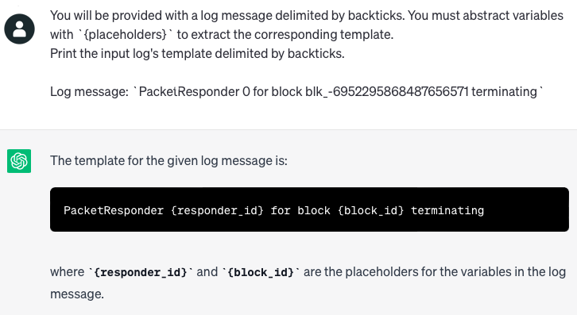
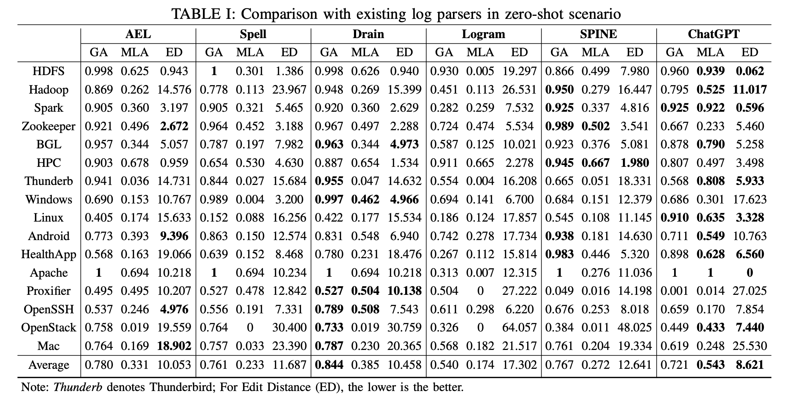
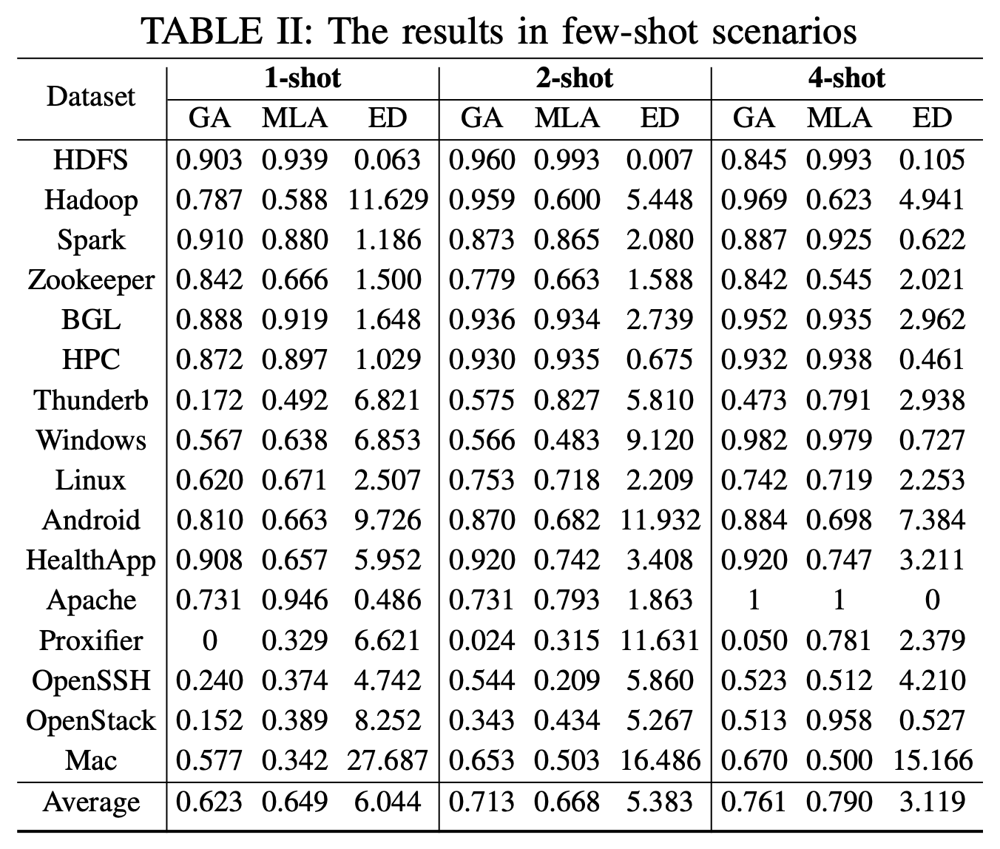
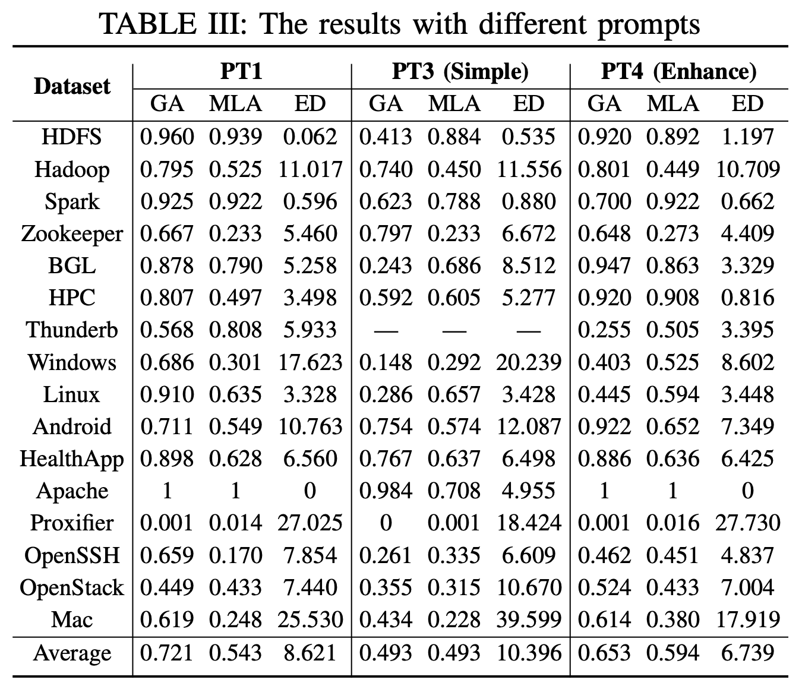

## Log Parsing with ChatGPT

[//]: # (Artifact for the ASE 2023 - NIER Track #180: "Log Parsing: How Far Can ChatGPT Go?")

**Introduction**:  In this paper, we conduct a preliminary evaluation of 
ChatGPT for log parsing. We design appropriate prompts to guide
ChatGPT to understand the log parsing task and extract the
log event/template from the input log messages.

**_Example:_**

<p align="center"></p>

### I. Study Design
#### 1.1. Research questions
##### _a) RQ1: Can ChatGPT effectively perform log parsing?_

We provide a basic definition of log parsing (i.e., abstracting the dynamic 
variables in logs) and ask ChatGPT to extract the log template for one log 
message using prompt:

```text
You will be provided with a log message delimited by backticks. You must abstract variables with `{placeholders}` to extract the corresponding template.
Print the input log’s template delimited by backticks.

Log message: `[LOG]`
```

##### _b) RQ2: How does ChatGPT perform with different prompting methods?_

We evaluate the performance of ChatGPT on log parsing in two scenarios:
- Few-shot scenarios: We use the following prompt to evaluate the generality of ChatGPT generality to a variety of log data.

```text
You will be provided with a log message delimited by backticks. You must abstract variables with `{placeholders}` to extract the corresponding template.
For example:
The template of `[DEMO_LOG1]` is `[TEMPLATE1]`.
The template of `[DEMO_LOG2]` is `[TEMPLATE2]`.
...
Print the input log's template delimited by backticks.

Log message: `[LOG]`
```

- Different prompts: We evaluate the impact of _simple_ and _enhance_ prompts on log parsing with ChatGPT.
  
  - Simple:
  ```text
  You will be provided with a log message delimited by backticks. Please extract the log template from this log message:
  `[LOG]`
  
  Log template: 
  ```
  - Enhance:
  ```text
  You will be provided with a log message delimited by backticks. You must identify and abstract all the dynamic variables in logs with `{placeholders}` and output a static log template.
  Print the input log's template delimited by backticks.
  
  Log message: `[LOG]`
  ```

#### 1.2. Datasets
We use 16 representative log datasets from a wide range of systems for the evaluation,
including distributed systems (i.e., HDFS, Hadoop, Spark, Zookeeper, OpenStack),
supercomputers (i.e., BGL, HPC, Thunderbird),
operating systems (i.e., Windows, Linux, Mac),
mobile systems (i.e., Android, HealthApp),
server applications (i.e., Apache, OpenSSH),
and standalone softwares (i.e., Proxifier).
Each dataset contains 2,000 manually labelled log messages
The dataset originated from [LogPAI](https://github.com/logpai/logparser). We use a [corrected version](https://figshare.com/articles/software/Artifact_for_Guidelines_for_Assessing_the_Accuracy_of_Log_Message_Template_Identification_Techniques_/18858332) from recent studies for our study. 

### II. Benchmark
1. Set the Open AI API Key at `/chat/__init__.py (OPEN_AI_KEY)`
2. Run the script `python main.py` to generate log templates with ChatGPT
3. Set the output directory at `/outputs/post_process.py` and run the script `cd outputs && python post_process.py` to apply common post-process rules for log parsing.
4. Set the output directory at `evaluate.py` and run the script `python evaluate.py`

### III. Experimental results
#### 3.1. RQ1: Can ChatGPT effectively perform log parsing?

<p align="center"></p>

#### 3.2. RQ2: How does ChatGPT perform with different prompting methods?
#### **_a) Few-shot scenarios:_**
<p align="center"></p>


#### **_b) Different prompts:_**
<p align="center"></p>

### Acknowledgement
- We adopt the implementation for baselines and evaluation metrics from [logparser](https://github.com/logpai/logparser)
and an [empirical study](https://figshare.com/articles/software/Artifact_for_Guidelines_for_Assessing_the_Accuracy_of_Log_Message_Template_Identification_Techniques_/18858332).

- We use the implementation provided by authors for [SPINE](https://doi.org/10.1145/3540250.3549176).

- We adopt the few-shot data sampling from [LogPPT](https://github.com/LogIntelligence/LogPPT).

### References:
1. Tools and Benchmarks for Automated Log Parsing. International Conference on Software Engineering (ICSE), 2019.
2. Guidelines for assessing the accuracy of log message template identification techniques. International Conference on Software Engineering (ICSE), 2022.
3. Log Parsing with Prompt-based Few-shot Learning. International Conference on Software Engineering (ICSE), 2023.